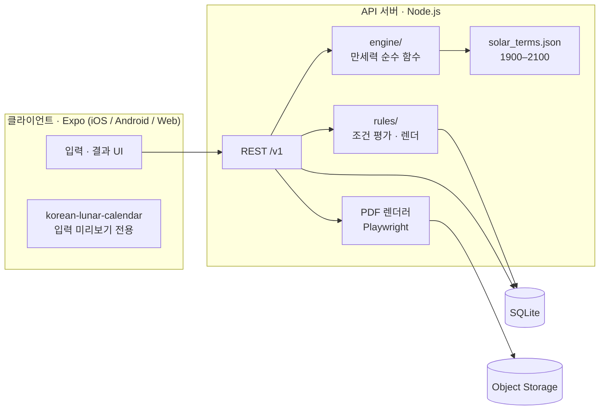
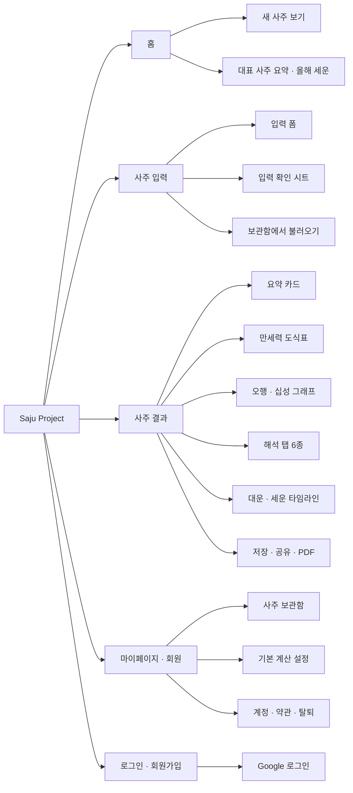
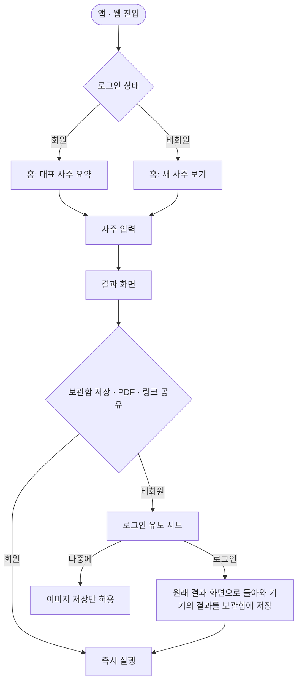
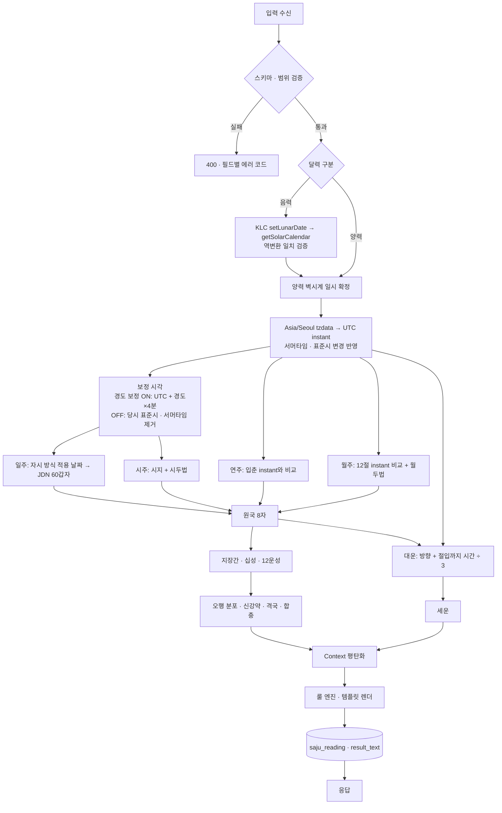
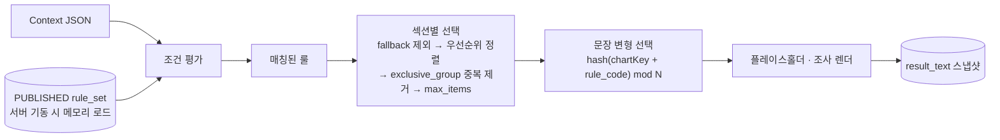
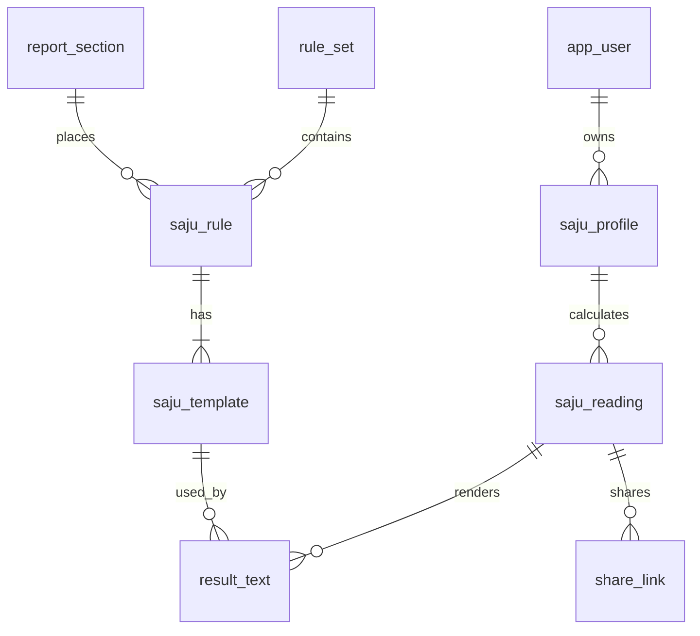

# Saju Project PRD

| 항목 | 내용 |
|---|---|
| 문서 버전 | v1.0 (Draft) |
| 작성일 | 2026-09-13 |
| 대상 | 개발(클라이언트·서버), 디자인, 콘텐츠(명리 감수) |
| 범위 | MVP (웹 + iOS/Android) |

> **읽는 법** — §4(만세력 엔진)와 §5(룰 엔진)는 구현 명세입니다. 공식·경계값·우선순위는 그대로 구현하고, 바꾸려면 §10 미결 사항에 올린 뒤 결정합니다. 문서 전체에서 **예시 사용자**는 `홍길동 · 남 · 양력 1990-01-01 14:30 · 서울`이며, 예시 값은 설명용이고 골든 테스트(§4.8)로 최종 검증합니다.

---

## 1. 개요

### 1.1 목표

- 정확한 만세력(24절기·표준시 이력·경도 보정 반영)으로 사주 원국을 산출하고 시각화한다.
- 산출 파라미터를 조건 코드로 매핑하는 **룰 베이스 템플릿**으로, 호출당 수 ms 안에 재현 가능한(같은 사주 → 같은 문장) 해석 리포트를 제공한다.
- 비회원도 결과까지 한 번에 도달하고, 저장·PDF·링크 공유에서 회원 전환을 유도한다.

### 1.2 범위

| 구분 | MVP 포함 | Phase 2 이후 |
|---|---|---|
| 계산 | 사주 8자, 지장간, 십성, 12운성, 오행 분포, 신강약, 격국(내격), 천간합·지지 육합·충, 대운, 세운 | 신살·공망, 용신, 외격(종격 등), 월운·일진, 균시차 보정, 해외 출생 시간대 |
| 해석 | 총운 · 기본 성향 · 재물운 · 직업운 · 연애운 · 대운 흐름 | 궁합, 올해의 운세 상세, 월별 운세 |
| 기능 | 회원/비회원, 사주 보관함, 이미지 저장, PDF, 공유 링크 | 푸시 알림, 어드민 CMS, 결제 |

### 1.3 성공 지표

| 지표 | 목표 |
|---|---|
| 입력 시작 → 결과 도달률 | ≥ 75% |
| 결과 API 응답 p95 | ≤ 300 ms |
| 골든 테스트 8자·대운수 일치율 | 100% |
| 결과 조회 → 저장(회원 전환 포함) | ≥ 20% |
| 결과 조회 → 공유 | ≥ 8% |

### 1.4 용어

| 용어 | 정의 |
|---|---|
| 원국 | 연·월·일·시주 4기둥, 천간 4 + 지지 4 = 8자 |
| 일간(DM) | 일주의 천간. 모든 십성·12운성의 기준 |
| 절(節) / 절입 | 24절기 중 월의 시작이 되는 12절기와 그 천문 시각 |
| 정자시 (`UNIFIED`) | 23:00부터 다음 날로 보는 방식 |
| 야자시·조자시 (`SPLIT`) | 23:00–24:00은 당일(야자시), 00:00–01:00은 익일(조자시)로 보는 방식 |
| 경도 보정 | 출생지 경도 기준 지방평균시(LMT)로 시각을 환산 |
| 대운수 | 첫 대운이 시작되는 나이 |

---

## 2. 시스템 아키텍처

### 2.1 기술 스택

| 영역 | 선택 | 근거 |
|---|---|---|
| 클라이언트 | **Expo (React Native) + Expo Router**, react-native-web | iOS·Android·Web 단일 코드베이스 |
| API | Node.js 20 + TypeScript + Fastify | 엔진·룰 엔진을 같은 언어로 |
| 음양력 변환 | `korean-lunar-calendar` | 한국천문연구원(KASI) 기준 한국 음력. 중국 음력과 날짜가 다른 해가 있어 한국 라이브러리 필수 |
| 절기 | **사전 계산 JSON** `solar_terms.json` (1900–2100) | `astronomy-engine`으로 1회 생성 후 KASI 공표값과 대조. 런타임 천문 계산 없음 |
| 시간대 | IANA tzdata `Asia/Seoul` (Luxon) | 서머타임·표준시 변경 이력 자동 반영 |
| 교차 검증 | `lunar-javascript` (6tail) | 절기 기반 八字·大运 구현 보유. **테스트에서만** 사용 |
| DB | **SQLite** (Node 내장 `node:sqlite`) | 서버 1대 베타 규모에 충분하고 DB 서버·드라이버가 필요 없음. JSON은 TEXT + `json_valid`. 서버를 여러 대로 늘릴 때 서버형 DB로 이전 |
| 인증 | **Google** OAuth → 자체 토큰 | 로그인 수단은 Google 하나 |
| 내보내기 | 이미지: 클라이언트 캡처(`react-native-view-shot` / 웹 `html-to-image`), PDF: 서버 Playwright HTML→PDF | PDF는 폰트·레이아웃 일관성 위해 서버 렌더 |
| 스토리지 | S3 호환 Object Storage | PDF, 공유 OG 이미지 |

엔진은 **서버에서만** 실행합니다. 해석 템플릿은 콘텐츠 자산이라 클라이언트에 내려보내지 않고, tzdata 버전을 서버에서 고정해야 계산이 재현됩니다. 클라이언트는 입력 중 "반대 달력 미리보기"에만 `korean-lunar-calendar`를 씁니다.

Redis 등 캐시는 두지 않습니다. 계산+렌더가 수 ms라 캐시 이득보다 무효화 비용이 큽니다(p95가 목표를 넘으면 그때 도입).



### 2.2 저장소 구조

```text
saju-project/
├─ apps/
│  ├─ mobile/            # Expo: iOS · Android · Web
│  └─ api/
│     ├─ src/engine/     # 만세력 계산 (IO 없음, 순수 함수)
│     ├─ src/rules/      # 조건 평가 + 템플릿 렌더
│     ├─ data/solar_terms.json
│     └─ test/golden/    # 골든 테스트 케이스
└─ scripts/
   ├─ gen-solar-terms.ts # 절기 테이블 생성 (1회)
   └─ import-rules.ts    # 콘텐츠 시트 → rule_set DRAFT 적재
```

---

## 3. 서비스 메뉴 구조 (IA)

### 3.1 메뉴 트리



### 3.2 화면 목록

| 화면 ID | 화면 | 접근 | 비고 |
|---|---|---|---|
| SCR-HOME | 홈 | 전체 | 회원은 대표 사주 요약 노출 |
| SCR-AUTH-01 | 소셜 로그인 | 전체 | 결과 화면에서 바텀시트로도 호출 |
| SCR-INPUT-01 | 사주 입력 | 전체 | §7.1 |
| SCR-INPUT-02 | 입력 확인 시트 | 전체 | 양/음력 변환 결과 재확인 |
| SCR-RESULT-01 | 결과 메인 | 전체 | 요약 · 만세력 · 오행/십성 |
| SCR-RESULT-02 | 해석 탭 | 전체 | 총운 · 성향 · 재물 · 직업 · 연애 · 대운 |
| SCR-RESULT-03 | 대운·세운 상세 | 전체 | |
| SCR-RESULT-04 | 용어 풀이 시트 | 전체 | 만세력 셀 탭 시 |
| SCR-SHARE-01 | 저장·공유 시트 | 전체 | 비회원은 이미지만 |
| SCR-SHARE-02 | 공유 링크 열람 | 링크 보유자 | 로그인 불필요, 입력 CTA |
| SCR-MY-01 | 마이페이지 | 회원 | |
| SCR-MY-02 | 사주 보관함 | 회원 | 목록·태그·대표 지정·삭제 |
| SCR-MY-03 | 기본 계산 설정 | 회원 | 자시 방식·경도 보정 기본값 |
| SCR-MY-04 | 계정·약관·탈퇴 | 회원 | |

### 3.3 회원 / 비회원 진입 경로



| 기능 | 비회원 | 회원 |
|---|---|---|
| 입력 · 결과 · 전체 해석 | O | O |
| 결과 이미지 저장 | O | O |
| 공유 링크 · PDF | X (로그인 유도) | O |
| 보관함 | 기기 로컬 최근 1건 | 최대 50건 |
| 기본 계산 설정 | 기기 로컬 | 계정 저장 |

비회원 결과는 서버에 저장하지 않고 기기에만 둡니다. 비회원이 "보관함에 저장"을 누르면 Google 로그인을 거쳐 같은 결과 화면(`/result?save=1`)으로 돌아오고, 로그인 전의 저장 의도를 이어받아 그 결과를 계정 보관함에 저장합니다. 같은 사주(이름·성별·출생 정보·지역이 같음)를 다시 저장하면 새로 만들지 않고 계산 방식만 갱신합니다 — 비교는 입력값의 HMAC으로 하므로 원문 없이 가능합니다. 보관함의 이름·생년월일시는 AES-256-GCM으로 암호화하고, 저장한 사주를 열 때마다 현재 발행 룰 세트로 다시 계산합니다.

---

## 4. 만세력 엔진

### 4.1 전체 데이터 흐름



핵심 원칙 두 가지:

1. **연주·월주는 절입 시각(UTC instant)과 출생 instant를 비교**합니다. 절입은 천문 사건이라 지역 보정과 무관합니다.
2. **일주·시주는 보정 시각(벽시계)** 으로 판단합니다. 경도 보정과 자시 방식은 여기에만 적용됩니다.

### 4.2 입력 정규화

```json
{
  "profile": {
    "name": "홍길동",
    "gender": "M",
    "calendar": "SOLAR",
    "isLeapMonth": false,
    "birthDate": "1990-01-01",
    "birthTime": "14:30",
    "regionCode": "11"
  },
  "options": {
    "jasiMode": "UNIFIED",
    "longitudeCorrection": true
  }
}
```

| 필드 | 규칙 | 에러 코드 |
|---|---|---|
| `gender` | `M` \| `F` 필수 | `GENDER_REQUIRED` |
| `calendar` | `SOLAR` \| `LUNAR` | `CALENDAR_INVALID` |
| `isLeapMonth` | `LUNAR`일 때만 의미. 해당 음력 연월에 윤달이 없으면 거부 | `LEAP_MONTH_NOT_EXIST` |
| `birthDate` | 1900-01-01 ≤ 양력 환산일 ≤ 오늘. 실존 날짜. 음력은 해당 월 일수(29/30) 이내 | `DATE_OUT_OF_RANGE`, `DATE_NOT_EXIST` |
| `birthTime` | `HH:mm` 또는 `null`(시간 모름) | `TIME_INVALID` |
| `regionCode` | 시·도 코드(부록 D). 기본 `11` 서울 | `REGION_INVALID` |
| 서머타임 전환 | 존재하지 않는 시각(봄 전환 공백)은 거부, 두 번 있는 시각(가을 전환)은 표준시로 해석 | `TIME_NOT_EXIST_DST` |

**음력 → 양력**

```ts
import KoreanLunarCalendar from 'korean-lunar-calendar';

const cal = new KoreanLunarCalendar();
const valid = cal.setLunarDate(y, m, d, isLeapMonth); // 유효하지 않으면 false
const solar = cal.getSolarCalendar();                   // { year, month, day }
// 역변환 검증: setSolarDate(solar) → getLunarCalendar()가 입력과 같아야 통과
```

> **주의** — `korean-lunar-calendar`의 간지 출력(`getKoreanGapjaString` 등)은 **음력 연·월 기준**이라 입춘·절기 기준인 사주 연주·월주와 다를 수 있습니다. 라이브러리는 **음양력 변환과 일진 교차 검증에만** 사용하고, 연주·월주는 반드시 절기 테이블로 계산합니다. 지원 범위는 양력 1000-02-13 ~ 2050-12-31이며, 서비스 입력 범위(1900 ~ 오늘)는 이 안에 있습니다.

### 4.3 시간 보정

한국 표준시는 여러 번 바뀌었고 서머타임도 시행됐습니다. 이력은 tzdata `Asia/Seoul`에 모두 들어 있으므로 **직접 테이블을 만들지 않고** 벽시계 → UTC 변환에 tzdata를 씁니다.

| 기간 | UTC 오프셋 | 비고 |
|---|---|---|
| ~ 1908-03-31 | +8:27:52 | 지방평균시 |
| 1908-04-01 ~ 1911-12-31 | +8:30 | |
| 1912-01-01 ~ 1954-03-20 | +9:00 | |
| 1954-03-21 ~ 1961-08-09 | +8:30 | |
| 1961-08-10 ~ | +9:00 | |
| 1948–1951, 1955–1960, 1987–1988 일부 기간 | +1:00 추가 | 서머타임 |

보정 시각 산출:

```ts
const utc = DateTime.fromObject(wallClock, { zone: 'Asia/Seoul' }).toUTC();

// 경도 보정 ON (기본): 지방평균시. 표준시·서머타임 이력과 무관하게 한 줄로 끝남
const corrected = utc.plus({ minutes: lon * 4 });             // 서울 126.98° → UTC+8:27:55

// 경도 보정 OFF: 당시 표준시, 서머타임만 제거
const local = utc.setZone('Asia/Seoul');
const correctedOff = local.minus({ hours: local.isInDST ? 1 : 0 });
```

서울 기준 보정량은 현행 KST 대비 약 −32분이며, 결과 화면에 "경도 보정 −32분 · 서머타임 −60분 적용"처럼 적용 내역을 표시합니다. 균시차(최대 ±16분)는 Phase 2 옵션입니다.

### 4.4 사주 8자 산출

인덱스 규약: 천간 `갑0 을1 병2 정3 무4 기5 경6 신7 임8 계9`, 지지 `자0 축1 인2 묘3 진4 사5 오6 미7 신8 유9 술10 해11`, 60갑자 `갑자0 … 계해59`. 코드표는 부록 A.

**① 연주 — 입춘 기준**

```ts
const sajuYear = birthUtc >= ipchun(calendarYear) ? calendarYear : calendarYear - 1;
const yearStem   = mod(sajuYear - 4, 10);
const yearBranch = mod(sajuYear - 4, 12);   // 1984 → 갑자
```

**② 월주 — 12절 기준 + 월두법**

| 절 | 태양 황경 | 월지 | | 절 | 태양 황경 | 월지 |
|---|---|---|---|---|---|---|
| 입춘 | 315° | 인 | | 입추 | 135° | 신 |
| 경칩 | 345° | 묘 | | 백로 | 165° | 유 |
| 청명 | 15° | 진 | | 한로 | 195° | 술 |
| 입하 | 45° | 사 | | 입동 | 225° | 해 |
| 망종 | 75° | 오 | | 대설 | 255° | 자 |
| 소서 | 105° | 미 | | 소한 | 285° | 축 |

```ts
const term = lastJeolAtOrBefore(birthUtc);          // 절입 instant ≤ 출생 → 새 달
const monthBranch = term.branch;
const m = mod(monthBranch - 2, 12);                 // 인월=0 … 축월=11
const monthStem = mod(yearStem * 2 + 2 + m, 10);    // 갑기년 인월=병인, 자월=병자
```

**③ 일주 — 자시 방식 적용 후 JDN**

```ts
const { date, minutes } = corrected;                // 보정 시각의 날짜 · 분
const lateNight = minutes >= 23 * 60;
const dayDate = (jasiMode === 'UNIFIED' && lateNight) ? date.plus({ days: 1 }) : date;
const dayIdx = mod(jdn(dayDate) + 49, 60);          // 2000-01-01 → 54 무오
```

`korean-lunar-calendar`의 일진과 교차 검증합니다(불일치 시 에러 로그, 테스트 실패).

**④ 시주 — 시지 + 시두법**

```ts
const hourBranch = Math.floor((minutes + 60) / 120) % 12;   // 23:00–00:59 = 자
let stemBase = dayStem;
if (jasiMode === 'SPLIT' && lateNight) stemBase = dayStem + 1; // 야자시: 다음 날 기준 자시 천간
const hourStem = mod(stemBase * 2 + hourBranch, 10);        // 갑기일 자시=갑자, 을경일=병자
```

| 보정 시각 | `UNIFIED` 일주 | `SPLIT` 일주 | 시주 천간 기준 |
|---|---|---|---|
| 22:59 | 당일 | 당일 | 당일 (해시) |
| 23:30 | **익일** | 당일 (야자시) | 익일 일간 |
| 00:30 | 당일 | 당일 (조자시) | 당일 일간 |

**시간 모름**: 시주를 산출하지 않고 6자로 분석합니다. 연·월주와 대운 계산에는 12:00을 가정하고, 아래 경우 결과 상단에 경고를 표시합니다.

- 출생일이 절입일이면: "태어난 시간에 따라 월주(입춘일이면 연주)가 달라질 수 있습니다."
- 항상: "시간 미상으로 대운 시작 시기에 최대 ±4개월 오차가 있습니다."

**예시 사용자 결과**

| | 시주 | 일주 | 월주 | 연주 |
|---|---|---|---|---|
| 간지 | 을미 乙未 | 병인 丙寅 | 병자 丙子 | 기사 己巳 |
| 근거 | 14:30(보정 13:58) → 미시, 병신일 → 을미 | JDN 2447893 → idx 2 | 대설 후·소한 전 → 자월, 기년 → 병자 | 입춘 전 → 1989 |

### 4.5 파생 지표

**지장간** (여기 · 중기 · 정기, 괄호는 일수)

| 지지 | 여기 | 중기 | 정기 | | 지지 | 여기 | 중기 | 정기 |
|---|---|---|---|---|---|---|---|---|
| 자 | 임(10) | — | 계(20) | | 오 | 병(10) | 기(9) | 정(11) |
| 축 | 계(9) | 신(3) | 기(18) | | 미 | 정(9) | 을(3) | 기(18) |
| 인 | 무(7) | 병(7) | 갑(16) | | 신 | 무(7) | 임(7) | 경(16) |
| 묘 | 갑(10) | — | 을(20) | | 유 | 경(10) | — | 신(20) |
| 진 | 을(9) | 계(3) | 무(18) | | 술 | 신(9) | 정(3) | 무(18) |
| 사 | 무(7) | 경(7) | 병(16) | | 해 | 무(7) | 갑(7) | 임(16) |

**십성** — 천간은 그 천간, 지지는 **정기 천간**으로 판정합니다(자·오·사·해의 음양이 체용에 따라 뒤바뀌는 문제를 정기로 해결).

```ts
const E = (stem) => Math.floor(stem / 2);            // 목0 화1 토2 금3 수4
const rel = mod(E(target) - E(dm), 5);              // 0 비겁 · 1 식상 · 2 재성 · 3 관성 · 4 인성
const same = (target % 2) === (dm % 2);
const TEN_GODS = [
  ['BIGYEON', 'GEOBJAE'], ['SIKSIN', 'SANGGWAN'], ['PYEONJAE', 'JEONGJAE'],
  ['PYEONGWAN', 'JEONGGWAN'], ['PYEONIN', 'JEONGIN'],
];
const god = TEN_GODS[rel][same ? 0 : 1];
```

**12운성** — 일간 기준. 장생지: 갑=해, 병·무=인, 경=사, 임=신 (양간 순행) / 을=오, 정·기=유, 신=자, 계=묘 (음간 역행).

```ts
const STAGES = ['JANGSAENG','MOKYOK','GWANDAE','GEONROK','JEWANG','SOE','BYEONG','SA','MYO','JEOL','TAE','YANG'];
const START = [11, 6, 2, 9, 2, 9, 5, 0, 8, 3];      // 갑~계의 장생지 지지 인덱스
const stage = dm % 2 === 0 ? mod(branch - START[dm], 12) : mod(START[dm] - branch, 12);
```

**오행 분포** — 그래프와 룰 조건이 **같은 값**을 씁니다.

| 위치 | 가중치 |
|---|---|
| 천간 4자 | 각 1.0 (그 천간의 오행) |
| 지지 4자 | 각 1.0 (그 지지의 오행), **월지만 1.5** |

`oh.ratio[e] = 가중합[e] / 전체 가중합`. 시간 모름이면 시주를 빼고 정규화합니다. 단순 개수 `oh.count`는 보조 표기용입니다.

**신강·신약** — 일간을 제외한 7자리 중 비겁·인성의 가중합(총 100점).

| 월지 | 일지 | 월간 | 시간 | 시지 | 연간 | 연지 |
|---|---|---|---|---|---|---|
| 30 | 15 | 12 | 12 | 12 | 10 | 9 |

| 점수 | ~24 | 25–44 | 45–55 | 56–74 | 75~ |
|---|---|---|---|---|---|
| `strength.band` | `VERY_WEAK` | `WEAK` | `BALANCED` | `STRONG` | `VERY_STRONG` |

시간 모름이면 남은 가중치 합으로 100점 환산. 가중치·구간은 초기값이며 명리 감수 후 `engine_config`에서 조정합니다(엔진 버전 업).

**격국 (내격 10종)**

1. 월지 정기 십성이 비견 → `GEONROK`(건록격), 겁재 → `YANGIN`(양인격).
2. 월지 지장간을 정기 → 중기 → 여기 순으로 보며, 연간·월간·시간에 **투출**된 첫 천간의 십성으로 격을 정합니다(비겁은 건너뜀).
3. 투출이 없으면 정기 십성으로 정합니다.

결과 코드: `JEONGGWAN · PYEONGWAN · JEONGJAE · PYEONJAE · SIKSIN · SANGGWAN · JEONGIN · PYEONIN · GEONROK · YANGIN`.

**합·충 (MVP)**

| 종류 | 조합 |
|---|---|
| 천간합 | 갑기(토) · 을경(금) · 병신(수) · 정임(목) · 무계(화) |
| 지지 육합 | 자축 · 인해 · 묘술 · 진유 · 사신 · 오미 |
| 지지 충 | 자오 · 축미 · 인신 · 묘유 · 진술 · 사해 |

### 4.6 대운 · 세운

**방향** — 연간 음양 × 성별.

| | 양간 연(갑병무경임) | 음간 연(을정기신계) |
|---|---|---|
| 남 | 순행 | **역행** |
| 여 | 역행 | 순행 |

**대운수**

```ts
const target = forward ? nextJeolAfter(birthUtc) : lastJeolAtOrBefore(birthUtc);
const days = Math.abs(target.utc - birthUtc) / 86_400_000;
const startAgeExact = days / 3;                         // 3일 = 1년, 1일 = 4개월
const number = Math.max(1, Math.round(startAgeExact));  // 나머지 2일 이상 올림 = 반올림, 최소 1
const startAt = birthUtc + startAgeExact * 365.2422 * 86_400_000;
```

**대운 기둥** — 월주 60갑자 인덱스에서 순행 `+i`, 역행 `−i` (i = 1…10). i번째 대운 시작 나이 = `startAgeExact + 10(i−1)`.

**세운** — Y년 간지 = `mod(Y − 4, 60)`, 해당 해 입춘부터 적용. 엔진은 출생~100세를 모두 계산하고 UI는 올해 −1 ~ +8년을 보여줍니다.

**표기** — 만 나이 기준. 예: "대운수 8 · 1998년 5월경 시작 (을해)". 대운 시작 연월은 `startAt`으로 표시합니다.

**예시 사용자** — 기(음)년 · 남 → 역행. 직전 절 대설(1989-12-07경)까지 약 25일 → 대운수 8.

| 순서 | 1 | 2 | 3 (현재) | 4 | 5 |
|---|---|---|---|---|---|
| 대운 | 을해 | 갑술 | **계유** | 임신 | 신미 |
| 시작 나이 | 8.4 | 18.4 | 28.4 | 38.4 | 48.4 |

### 4.7 파라미터 조합 — Context

엔진 출력은 룰 엔진이 점 표기(`oh.ratio.WOOD`)로 바로 읽을 수 있는 **평탄한 JSON 하나**입니다. 여러 필드를 비교해야 하는 판정(예: "대운 오행이 원국에 없는 오행인가")은 룰에서 표현하지 않고 **엔진이 미리 계산해 불리언 파라미터로 넣습니다.** 그래서 조건식은 단순 비교만으로 충분합니다.

```json
{
  "meta": { "engineVersion": "1.0.0", "gender": "M", "hourKnown": true,
            "jasiMode": "UNIFIED", "correctionMin": -32, "dstApplied": false },
  "pillars": {
    "year":  { "stem": "GI",     "branch": "SA" },
    "month": { "stem": "BYEONG", "branch": "JA" },
    "day":   { "stem": "BYEONG", "branch": "IN" },
    "hour":  { "stem": "EUL",    "branch": "MI" }
  },
  "dm": { "stem": "BYEONG", "element": "FIRE", "yinyang": "YANG", "nameKo": "병화", "hanja": "丙火" },
  "tenGods": {
    "year":  { "stem": "SANGGWAN", "branch": "BIGYEON" },
    "month": { "stem": "BIGYEON",  "branch": "JEONGGWAN" },
    "day":   { "stem": null,       "branch": "PYEONIN" },
    "hour":  { "stem": "JEONGIN",  "branch": "SANGGWAN" }
  },
  "twelveStages": { "year": "GEONROK", "month": "TAE", "day": "JANGSAENG", "hour": "SOE" },
  "oh": {
    "count": { "WOOD": 2, "FIRE": 3, "EARTH": 2, "METAL": 0, "WATER": 1 },
    "ratio": { "WOOD": 0.235, "FIRE": 0.353, "EARTH": 0.235, "METAL": 0, "WATER": 0.176 },
    "max": "FIRE", "missing": ["METAL"]
  },
  "ss": {
    "count": { "BIGYEON": 2, "GEOBJAE": 0, "SIKSIN": 0, "SANGGWAN": 2, "PYEONJAE": 0,
               "JEONGJAE": 0, "PYEONGWAN": 0, "JEONGGWAN": 1, "PYEONIN": 1, "JEONGIN": 1 },
    "group": { "BIGEOP": 2, "SIKSANG": 2, "JAESEONG": 0, "GWANSEONG": 1, "INSEONG": 2 }
  },
  "strength": { "score": 48, "band": "BALANCED" },
  "gyeok": "JEONGGWAN",
  "relations": { "stemCombine": [], "branchCombine": [], "branchClash": [], "dayBranchClash": false },
  "love": { "spouseStarGroup": "JAESEONG", "spouseStarCount": 0 },
  "daewoon": {
    "direction": "BACKWARD", "number": 8, "startAgeExact": 8.4,
    "current": { "order": 3, "stem": "GYE", "branch": "YU", "ganjiKo": "계유",
                 "stemGroup": "GWANSEONG", "branchGroup": "JAESEONG",
                 "fillsMissing": true, "yearsToNext": 1.7 }
  },
  "seun": { "year": 2026, "ganjiKo": "병오", "stemGroup": "BIGEOP", "branchGroup": "BIGEOP" }
}
```

선계산 파라미터 목록:

| 파라미터 | 계산 |
|---|---|
| `love.spouseStarGroup` | 남 `JAESEONG`, 여 `GWANSEONG` |
| `love.spouseStarCount` | `ss.group[spouseStarGroup]` |
| `relations.dayBranchClash` | 일지가 다른 지지와 충이면 `true` |
| `daewoon.current.fillsMissing` | 현재 대운 간지 오행 중 하나가 `oh.missing`에 있으면 `true` |
| `daewoon.current.yearsToNext` | 다음 대운 시작까지 남은 년수 |

> 계산 결과(`saju_reading.chart`)에는 이름·생년월일시 원문을 넣지 않습니다. 원문은 암호화된 `saju_profile`에만 둡니다.

### 4.8 정확도 검증

`scripts/gen-solar-terms.ts`로 절기 테이블을 생성하고, 골든 테스트를 CI 필수 게이트로 둡니다.

```ts
import { SearchSunLongitude, MakeTime } from 'astronomy-engine';
// 황경 lon°에 태양이 도달하는 시각. 대략적 시작일부터 40일 안에서 탐색
const t = SearchSunLongitude(lon, MakeTime(approxStartDate), 40);
// → { year, term, lon, branch, utc } 로 저장. KASI 공표 절입시각과 1분 넘게 다르면 KASI 값 사용
```

| 골든 케이스 | 수 | 확인 포인트 |
|---|---|---|
| 1900–2050 무작위 | 300 | 8자 전반 |
| 입춘 ±2시간 | 50 | 연주 경계 |
| 12절 절입 ±1시간 | 60 | 월주 경계 |
| 22:30–01:30 × 자시 방식 2종 | 40 | 일주·시주 |
| 음력 윤달 입력 | 30 | 변환·역변환 |
| 서머타임 기간 출생 | 20 | 1948–51 · 1955–60 · 1987–88 |
| UTC+8:30 기간 출생 | 20 | 1954–61 |
| 시간 모름 · 절입일 출생 | 20 | 6자 처리·경고 |

기준값: KASI 음양력·절기 자료 → `lunar-javascript` 교차 계산 → 명리 감수자 수기 확인 20건. 합격 기준은 8자·대운 방향·대운수 **100% 일치**입니다.

---

## 5. 룰 베이스 해석 엔진

### 5.1 개념 구조

세 층으로 나눕니다. 각 층이 한 가지 일만 해서 콘텐츠 작성자가 SQL을 몰라도 됩니다.

| 층 | 테이블 | 하는 일 | 예 |
|---|---|---|---|
| 원자 조건 | `condition_code` | Context 값 하나를 비교 | `OH_WOOD_GT_40` = `oh.ratio.WOOD > 0.40` |
| 규칙 | `saju_rule` | 원자 조건을 all · any · none으로 조합, 우선순위·노출 위치 결정 | `PERS_GAP_WOOD_OVER40` |
| 문장 | `saju_template` | 규칙에 1:N으로 붙는 문장 변형 | 변형 1, 2 |



### 5.2 DB 스키마



> 아래는 설계 기준 스키마입니다. 실제 적용 스키마는 SQLite로 옮긴 `apps/api/db/migrations/001_init.sql`이며 타입만 바꿨습니다: JSONB → TEXT + `json_valid`, BOOLEAN → 0/1, TIMESTAMPTZ → ISO-8601 문자열, UUID → 앱에서 생성, `app_user.provider`는 `GOOGLE`만 사용.

```sql
-- 룰 세트 버전: 발행된 버전만 서비스에 사용
CREATE TABLE rule_set (
  version       VARCHAR(20) PRIMARY KEY,               -- '2026.10.1'
  status        VARCHAR(10) NOT NULL CHECK (status IN ('DRAFT','PUBLISHED','ARCHIVED')),
  published_at  TIMESTAMPTZ,
  note          TEXT
);

-- 원자 조건 사전. 한 번 발행된 코드는 의미를 바꾸지 않는다(바꾸려면 새 코드)
CREATE TABLE condition_code (
  code        VARCHAR(50) PRIMARY KEY,                 -- 'OH_WOOD_GT_40'
  param_key   VARCHAR(80) NOT NULL,                    -- 'oh.ratio.WOOD'
  operator    VARCHAR(10) NOT NULL
              CHECK (operator IN ('eq','ne','gt','gte','lt','lte','in','contains')),
  value       JSONB NOT NULL,                          -- 0.40 / "GAP" / ["WEAK","VERY_WEAK"]
  label_ko    VARCHAR(100) NOT NULL                    -- '목 비율 40% 초과'
);

-- 카테고리별 섹션과 노출 개수
CREATE TABLE report_section (
  category       VARCHAR(20) NOT NULL,                 -- TOTAL / PERSONALITY / WEALTH / CAREER / LOVE / DAEWOON
  section        VARCHAR(20) NOT NULL,                 -- SUMMARY / DETAIL / ADVICE
  display_order  SMALLINT NOT NULL,
  max_items      SMALLINT NOT NULL DEFAULT 1,
  title_ko       VARCHAR(50),
  PRIMARY KEY (category, section)
);

CREATE TABLE saju_rule (
  rule_id          BIGSERIAL PRIMARY KEY,
  rule_set_ver     VARCHAR(20) NOT NULL REFERENCES rule_set(version),
  rule_code        VARCHAR(60) NOT NULL,               -- 'PERS_GAP_WOOD_OVER40'
  category         VARCHAR(20) NOT NULL,
  section          VARCHAR(20) NOT NULL,
  expr             JSONB NOT NULL,                     -- {"all":["DM_GAP","OH_WOOD_GT_40"]}
  priority         INT NOT NULL DEFAULT 100,
  exclusive_group  VARCHAR(40),                        -- 같은 그룹은 최상위 1개만 노출
  is_fallback      BOOLEAN NOT NULL DEFAULT false,
  is_active        BOOLEAN NOT NULL DEFAULT true,
  UNIQUE (rule_set_ver, rule_code),
  FOREIGN KEY (category, section) REFERENCES report_section(category, section)
);

CREATE TABLE saju_template (
  template_id  BIGSERIAL PRIMARY KEY,
  rule_id      BIGINT NOT NULL REFERENCES saju_rule(rule_id) ON DELETE CASCADE,
  variant_no   SMALLINT NOT NULL DEFAULT 1,
  title        VARCHAR(100),
  body         TEXT NOT NULL,                          -- '{{name}}님은 {{dm.nameKo|은는}} …'
  UNIQUE (rule_id, variant_no)
);

-- 사용자 데이터
CREATE TABLE app_user (
  user_id       UUID PRIMARY KEY DEFAULT gen_random_uuid(),
  provider      VARCHAR(10) NOT NULL,                  -- KAKAO / NAVER / APPLE / GOOGLE
  provider_uid  VARCHAR(100) NOT NULL,
  settings      JSONB NOT NULL DEFAULT '{}',           -- 기본 jasiMode, longitudeCorrection
  created_at    TIMESTAMPTZ NOT NULL DEFAULT now(),
  UNIQUE (provider, provider_uid)
);

CREATE TABLE saju_profile (
  profile_id        UUID PRIMARY KEY DEFAULT gen_random_uuid(),
  user_id           UUID REFERENCES app_user(user_id) ON DELETE CASCADE,  -- NULL = 비회원
  guest_token_hash  CHAR(64),
  name_enc          BYTEA,                             -- AES-256-GCM
  birth_enc         BYTEA NOT NULL,                    -- {calendar, isLeapMonth, date, time} 암호화
  gender            CHAR(1) NOT NULL CHECK (gender IN ('M','F')),
  region_code       VARCHAR(4) NOT NULL DEFAULT '11',
  options           JSONB NOT NULL,
  tag               VARCHAR(10),                       -- 본인 / 가족 / 친구 / 연인 / 기타
  is_primary        BOOLEAN NOT NULL DEFAULT false,
  expires_at        TIMESTAMPTZ,                       -- 비회원: 생성 + 7일
  created_at        TIMESTAMPTZ NOT NULL DEFAULT now()
);

CREATE TABLE saju_reading (
  reading_id      UUID PRIMARY KEY DEFAULT gen_random_uuid(),
  profile_id      UUID NOT NULL REFERENCES saju_profile(profile_id) ON DELETE CASCADE,
  engine_version  VARCHAR(20) NOT NULL,
  rule_set_ver    VARCHAR(20) NOT NULL REFERENCES rule_set(version),
  chart           JSONB NOT NULL,                      -- §4.7 Context (원문 개인정보 제외)
  created_at      TIMESTAMPTZ NOT NULL DEFAULT now()
);

-- 해석 스냅샷: 룰이 바뀌어도 저장된 결과 문장은 그대로
CREATE TABLE result_text (
  reading_id     UUID NOT NULL REFERENCES saju_reading(reading_id) ON DELETE CASCADE,
  category       VARCHAR(20) NOT NULL,
  section        VARCHAR(20) NOT NULL,
  seq            SMALLINT NOT NULL,
  template_id    BIGINT NOT NULL REFERENCES saju_template(template_id),
  rendered_text  TEXT NOT NULL,
  PRIMARY KEY (reading_id, category, section, seq)
);

CREATE TABLE share_link (
  token       CHAR(22) PRIMARY KEY,                    -- 무작위 base62, 개인정보 미포함
  reading_id  UUID NOT NULL REFERENCES saju_reading(reading_id) ON DELETE CASCADE,
  hide_birth  BOOLEAN NOT NULL DEFAULT true,
  expires_at  TIMESTAMPTZ NOT NULL,                    -- 기본 30일
  created_at  TIMESTAMPTZ NOT NULL DEFAULT now()
);
```

저장된 결과를 연 사용자에게 현재 발행 버전이 더 새로우면 "최신 해석으로 다시 보기" 버튼을 보여줍니다(누르면 새 `saju_reading` 생성).

### 5.3 조건 코드 체계

명명 규칙: `{도메인}_{대상}_{연산}_{값}`. 원자 조건은 콘텐츠 시트에서 손으로 만들지 않고 시드 스크립트로 일괄 생성합니다(약 110개).

| 도메인 | 생성 규칙 | 수 |
|---|---|---|
| `DM_` | 일간 10종 `eq` | 10 |
| `OH_` | 오행 5 × {`NONE` count=0, `LT_10`, `GT_30`, `GT_40`} | 20 |
| `SS_` 그룹 | 십성 그룹 5 × {`EQ_0`, `GTE_1`, `GTE_3`} | 15 |
| `SS_` 개별 | 십성 10 × {`GTE_1`, `GTE_2`} | 20 |
| `STR_` | 신강약 5구간 + `STR_WEAK_ANY`, `STR_STRONG_ANY` | 7 |
| `GYEOK_` | 격국 10종 | 10 |
| `DW_` · `SEUN_` | 현재 대운 천간/지지 그룹 5×2, 세운 그룹 5×2, `DW_FILLS_MISSING`, `DW_TRANSITION_SOON` | 22 |
| 기타 | `GENDER_M/F`, `HOUR_KNOWN`, `REL_DAY_BRANCH_CLASH`, `LOVE_SPOUSE_EQ_0/GTE_3` | 6 |

| code | param_key | operator | value | label_ko |
|---|---|---|---|---|
| `DM_GAP` | `dm.stem` | eq | `"GAP"` | 일간 갑목 |
| `OH_WOOD_GT_40` | `oh.ratio.WOOD` | gt | `0.40` | 목 비율 40% 초과 |
| `OH_METAL_NONE` | `oh.count.METAL` | eq | `0` | 금 없음 |
| `SS_JAESEONG_EQ_0` | `ss.group.JAESEONG` | eq | `0` | 재성 없음 |
| `SS_JAESEONG_GTE_3` | `ss.group.JAESEONG` | gte | `3` | 재성 3개 이상 |
| `STR_WEAK_ANY` | `strength.band` | in | `["WEAK","VERY_WEAK"]` | 신약 계열 |
| `GYEOK_JEONGGWAN` | `gyeok` | eq | `"JEONGGWAN"` | 정관격 |
| `GENDER_F` | `meta.gender` | eq | `"F"` | 여성 |
| `REL_DAY_BRANCH_CLASH` | `relations.dayBranchClash` | eq | `true` | 일지 충 |
| `DW_BRANCH_JAESEONG` | `daewoon.current.branchGroup` | eq | `"JAESEONG"` | 현재 대운 지지 재성 |
| `DW_FILLS_MISSING` | `daewoon.current.fillsMissing` | eq | `true` | 대운이 결핍 오행 보완 |
| `DW_TRANSITION_SOON` | `daewoon.current.yearsToNext` | lte | `1` | 1년 내 대운 교체 |

### 5.4 매핑 예시

요청 예시 **`일간 == 갑목` && `목 비율 > 40%`** 는 아래 `PERS_GAP_WOOD_OVER40` 입니다. 같은 `exclusive_group`의 일반 룰(`PERS_WOOD_OVER40`)보다 우선순위가 높아, 두 룰이 모두 맞으면 구체적인 쪽만 나갑니다.

| rule_code | 카테고리 / 섹션 | expr | priority | exclusive_group |
|---|---|---|---|---|
| `PERS_DM_GAP` | PERSONALITY / SUMMARY | `{"all":["DM_GAP"]}` | 100 | `PERS_DM` |
| `PERS_GAP_WOOD_OVER40` | PERSONALITY / DETAIL | `{"all":["DM_GAP","OH_WOOD_GT_40"]}` | 500 | `PERS_OH_EXCESS` |
| `PERS_WOOD_OVER40` | PERSONALITY / DETAIL | `{"all":["OH_WOOD_GT_40"]}` | 100 | `PERS_OH_EXCESS` |
| `WEALTH_JAE0_BALANCED` | WEALTH / SUMMARY | `{"all":["SS_JAESEONG_EQ_0","STR_BALANCED"]}` | 500 | `WEALTH_CORE` |
| `WEALTH_JAEDA_SINYAK` | WEALTH / SUMMARY | `{"all":["SS_JAESEONG_GTE_3","STR_WEAK_ANY"]}` | 500 | `WEALTH_CORE` |
| `WEALTH_SIKSANG_SAENGJAE` | WEALTH / DETAIL | `{"all":["SS_SIKSANG_GTE_1","SS_JAESEONG_GTE_1"],"none":["STR_VERY_WEAK"]}` | 300 | — |
| `CAREER_GYEOK_JEONGGWAN` | CAREER / SUMMARY | `{"all":["GYEOK_JEONGGWAN"]}` | 100 | `CAREER_GYEOK` |
| `CAREER_GWANIN_SANGSAENG` | CAREER / DETAIL | `{"all":["SS_GWANSEONG_GTE_1","SS_INSEONG_GTE_1"]}` | 300 | — |
| `LOVE_GWANSAL_MIXED_F` | LOVE / DETAIL | `{"all":["GENDER_F","SS_JEONGGWAN_GTE_1","SS_PYEONGWAN_GTE_1"]}` | 900 | `LOVE_STAR` |
| `LOVE_SPOUSE_NONE` | LOVE / SUMMARY | `{"all":["LOVE_SPOUSE_EQ_0"]}` | 300 | `LOVE_CORE` |
| `LOVE_DAY_BRANCH_CLASH` | LOVE / DETAIL | `{"all":["REL_DAY_BRANCH_CLASH"]}` | 300 | — |
| `DW_NEW_JAESEONG` | DAEWOON / SUMMARY | `{"all":["DW_BRANCH_JAESEONG","SS_JAESEONG_EQ_0"]}` | 500 | `DW_CORE` |
| `DW_FILLS_MISSING` | DAEWOON / DETAIL | `{"all":["DW_FILLS_MISSING"]}` | 500 | — |
| `DW_TRANSITION` | DAEWOON / ADVICE | `{"all":["DW_TRANSITION_SOON"]}` | 300 | — |
| `{CATEGORY}_FALLBACK` | 각 카테고리 / SUMMARY | `{}` | 0 | `is_fallback` |

템플릿 예:

```text
[PERS_GAP_WOOD_OVER40 · 변형 1]
{{name}}님은 곧게 뻗은 큰 나무인 {{dm.nameKo}}({{dm.hanja}}) 일간에, 사주 전체의
목 기운이 {{oh.ratio.WOOD|pct}}에 이릅니다. 한번 정한 방향을 끝까지 밀고 가는 힘이
크지만, 숲이 빽빽하면 햇빛이 들지 않듯 다른 의견이 들어올 틈이 좁아지기 쉽습니다.

[DW_NEW_JAESEONG · 변형 1]
원국에 드러나지 않았던 재성이 {{daewoon.current.ganjiKo}} 대운에서 들어와 있습니다.
돈과 성과를 직접 다루는 기회가 평소보다 많은 시기이니, 수입 구조를 넓히는 선택을
미루지 마세요.
```

**예시 사용자 매칭 추적** (병화 · 무금 · 중화 · 정관격 · 현재 계유 대운)

| 섹션 | 매칭 후보 | 선택 |
|---|---|---|
| PERSONALITY / SUMMARY | `PERS_DM_BYEONG`(100) | `PERS_DM_BYEONG` |
| PERSONALITY / DETAIL (max 3) | `PERS_METAL_NONE`(100), `PERS_FIRE_OVER30`(100), `PERS_GYEOK_JEONGGWAN`(100) | 3개 모두 |
| WEALTH / SUMMARY | `WEALTH_JAE0_BALANCED`(500), `WEALTH_JAE0`(100), `WEALTH_FALLBACK`(0) | fallback 제외 → 같은 그룹 → `WEALTH_JAE0_BALANCED` |
| DAEWOON / SUMMARY | `DW_NEW_JAESEONG`(500), `DW_BRANCH_JAE`(100) | `DW_NEW_JAESEONG` |
| DAEWOON / DETAIL | `DW_FILLS_MISSING`(500), `DW_STEM_GWAN`(100) | 둘 다 |

### 5.5 작동 알고리즘

```ts
const OPS = {
  eq: (a, b) => a === b,            ne: (a, b) => a !== b,
  gt: (a, b) => a > b,              gte: (a, b) => a >= b,
  lt: (a, b) => a < b,              lte: (a, b) => a <= b,
  in: (a, b) => b.includes(a),      contains: (a, b) => Array.isArray(a) && a.includes(b),
};

// 값이 없으면(예: 시간 모름의 시주 값) 조건은 항상 false
function evalCond(c, ctx) {
  const v = c.param_key.split('.').reduce((o, k) => o?.[k], ctx);
  return v != null && OPS[c.operator](v, c.value);
}

// expr: 코드 문자열 또는 {all, any, none} 객체(중첩 가능). 키가 여러 개면 모두 만족해야 함
function evalExpr(expr, ctx, conds) {
  if (typeof expr === 'string') return evalCond(conds[expr], ctx);
  const r = (e) => evalExpr(e, ctx, conds);
  return (!expr.all  ||  expr.all.every(r))
      && (!expr.any  ||  expr.any.some(r))
      && (!expr.none || !expr.none.some(r));
}

function buildReport(ctx, ruleSet) {
  const chartKey = pillarsString(ctx) + ctx.meta.gender;       // 이름 제외: 같은 사주 = 같은 문장
  return ruleSet.sections.map(({ category, section, maxItems }) => {
    let hit = ruleSet.rules
      .filter(r => r.category === category && r.section === section && evalExpr(r.expr, ctx, ruleSet.conds));
    if (hit.some(r => !r.isFallback)) hit = hit.filter(r => !r.isFallback);
    hit.sort((a, b) => b.priority - a.priority || leafCount(b.expr) - leafCount(a.expr)
                    || a.ruleCode.localeCompare(b.ruleCode));
    const seen = new Set();
    const picked = hit.filter(r => !r.exclusiveGroup || (!seen.has(r.exclusiveGroup) && seen.add(r.exclusiveGroup)))
                      .slice(0, maxItems);
    return picked.map((r, seq) => {
      const t = r.templates[fnv1a(chartKey + r.ruleCode) % r.templates.length];
      return { category, section, seq, templateId: t.id, text: render(t.body, ctx) };
    });
  });
}
```

**우선순위 관례**

| priority | 용도 |
|---|---|
| 900 | 3개 이상 조건의 특수 조합 (관살혼잡, 재다신약 등) |
| 500 | 2개 조건 조합 |
| 300 | 의미가 강한 단일 조건 (합충, 전환기) |
| 100 | 기본 단일 조건 |
| 0 | fallback |

**렌더링**

| 문법 | 결과 |
|---|---|
| `{{name}}` | 이름, 없으면 "당신" |
| `{{dm.nameKo\|은는}}` | 받침 있으면 첫 형태: "병화는", "갑목은" |
| 조사 필터 | `은는` · `이가` · `을를` · `과와` · `아야` |
| `{{oh.ratio.WOOD\|pct}}` | "42%" |

```ts
const hasBatchim = (w) => { const c = w.charCodeAt(w.length - 1) - 0xac00; return c >= 0 && c < 11172 && c % 28 !== 0; };
```

**발행 검증** (DRAFT → PUBLISHED 시 자동, 하나라도 실패하면 발행 불가)

- 모든 카테고리의 SUMMARY 섹션에 fallback 룰이 있다.
- `expr`의 모든 코드가 `condition_code`에 존재한다.
- 모든 룰에 템플릿이 1개 이상 있다.
- 템플릿 플레이스홀더가 허용 목록에 있다.
- **커버리지 시뮬레이션**: 1900–2050 무작위 출생 10,000건으로 리포트를 만들어 섹션별 "fallback만 나온 비율"이 5%를 넘으면 경고.

### 5.6 카테고리별 룰 설계

| 카테고리 | 섹션 (max) | 주요 입력 파라미터 | 룰 축 | 예상 룰 수 |
|---|---|---|---|---|
| 오늘의 운세 TODAY | SUMMARY(1), DETAIL(2), ADVICE(1) | `today.*` (서울 날짜 기준 오늘 일진의 천간·지지 십성 그룹, 일지 충·합, 일간 천간합) | 오늘 천간 그룹 5 · 지지 그룹 5 · 충/합 3 · 조언 6 — 탭 맨 앞, 날짜가 바뀌면 기기 저장 결과를 다시 계산 | 20 |
| 총운 TOTAL | SUMMARY(1), DETAIL(3) | `dm`, `strength`, `gyeok`, `oh.max/missing` | 일간 한 줄 + 강약 + 격국 + 오행 치우침 | 25 |
| 기본 성향 PERSONALITY | SUMMARY(1), DETAIL(3), ADVICE(1) | `dm`, `strength`, `oh`, `ss.group`, `gyeok` | 일간 10 · 일간×강약 50 · 오행 과다/결핍 15 · 십성 과다 10 · 격국 10 | 95 |
| 재물운 WEALTH | SUMMARY(1), DETAIL(2), ADVICE(1) | `ss.group.JAESEONG/SIKSANG/BIGEOP`, `strength` | 재성 수(0 / 1–2 / 3+) × 강약 3구간 · 식상생재 · 군겁쟁재 | 15 |
| 직업운 CAREER | SUMMARY(1), DETAIL(2) | `gyeok`, `ss.group` | 격국 10 · 관인상생 · 식상생재 · 살인상생 · 상관견관 | 18 |
| 연애운 LOVE | SUMMARY(1), DETAIL(2), ADVICE(1) | `love.*`, `tenGods.day.branch`, `relations` | 배우자성 수(성별) · 일지 십성 10 · 일지 합충 · 관살/재성 혼잡 | 20 |
| 대운 흐름 DAEWOON | SUMMARY(1), DETAIL(3), ADVICE(1) | `daewoon.current.*`, `seun.*`, `ss.group` | 대운 천간·지지 그룹 · 결핍 보완 · 전환기 · 올해 세운 그룹 | 37 |
| fallback | 각 SUMMARY | — | 카테고리당 1 | 6 |

MVP 합계 약 **216 룰 × 평균 2 변형 ≈ 430 문장**.

### 5.7 콘텐츠 작성 규칙

- 한 문장 블록 80–220자. 한 룰은 한 가지 이야기만 한다.
- 단정 금지: 질병명, 사망·사고·이혼 등 확정 표현을 쓰지 않는다. "~하기 쉽다", "~할 수 있다"로 쓴다.
- 부정적 SUMMARY/DETAIL 룰은 같은 카테고리 ADVICE 룰과 짝을 이룬다.
- 전문 용어는 첫 등장 시 풀이한다: "재성(돈과 결과를 뜻하는 기운)".
- 결과 하단 고지: "전통 명리 이론에 기반한 참고용 해석이며, 의학·법률·투자 판단의 근거가 아닙니다."

### 5.8 콘텐츠 운영 (MVP)

어드민 CMS는 Phase 2로 미룹니다. MVP는 스프레드시트로 운영합니다.

1. 콘텐츠팀이 `sections` · `rules` · `templates` 시트를 작성해 `apps/api/content/*.csv`로 내보냄. 조건은 JSON 대신 `all` · `any` · `none` 열에 조건 코드를 공백으로 구분해 적고, `is_fallback` · `is_active`는 `Y`/`N`.
2. `npm run rules:preview -- 1990-01-01 14:30 M`으로 매칭 추적(룰 코드·우선순위·선택/탈락 사유)과 렌더 결과를 확인.
3. `npm run rules:import`가 §5.5 발행 검증과 커버리지 시뮬레이션을 실행. 통과한 CSV를 저장소에 반영 (검토는 코드 리뷰로).
4. 배포하면 서버가 시작할 때 콘텐츠 내용으로 버전(`content-<해시>`)을 만들고, 처음 보는 버전이면 DB에 저장한 뒤 발행 (이전 발행본은 보관). 저장된 결과는 만들어질 당시 버전의 템플릿을 계속 가리킵니다.

템플릿 필터: `|ko`(코드 → 한글, 배열은 쉼표로 연결) · `|pct`(0.42 → 42%) · 조사 `|은는` `|이가` `|을를` `|과와` `|아야`. 필터는 이어 쓸 수 있습니다: `{{tenGods.day.branch|ko|이가}}` → "겁재가".

---

## 6. API 요약

| Method | Path | 인증 | 설명 |
|---|---|---|---|
| POST | `/v1/readings` | 없음 | 입력 → 계산 + 리포트 (서버에 저장하지 않음) |
| POST | `/v1/matches` | 없음 | 궁합: `{a, b, relation}` (a · b는 `/v1/readings`와 같은 입력, relation은 `PARTNER` 연인 · `FAMILY` 가족 · `FRIEND` 친구·동료) → 두 사람 chart + `match`(점수 40~98 · 등급 · 근거 칩) + 궁합 리포트. 관계에 따라 탭이 달라짐 (연애·결혼은 연인만, 소통은 가족·친구만). 입력 오류는 `a.birthDate`처럼 사람별 필드. 저장하지 않음 |
| GET | `/v1/auth/google/start` | 없음 | `?returnTo=/경로` → Google 로그인 화면으로 이동 (OIDC 인가 코드 + PKCE, 범위 `openid`) |
| GET | `/v1/auth/google/callback` | 없음 | 로그인 완료 → 세션 쿠키 발급 후 `returnTo`로 이동, 실패 시 `/?login=failed` |
| GET | `/v1/me` | 회원 | 로그인 상태 확인 (비로그인 401) |
| POST | `/v1/auth/logout` | 회원 | 이 기기 세션 삭제 |
| GET | `/v1/profiles` | 회원 | 보관함 목록 (최대 50): 이름·출생 정보·일주·현재 대운 |
| POST | `/v1/profiles` | 회원 | 사주 저장. 같은 사주면 새로 만들지 않고 계산 방식만 갱신 (201 / 200, 가득 차면 409 `ARCHIVE_FULL`) |
| POST | `/v1/pending-saves` | 없음 | 비회원 "로그인하고 저장": 입력을 30분 암호화해 맡기고 `{token}` (토큰은 해시만 저장). 로그인 뒤 돌아올 주소 `/result?claim=토큰` |
| POST | `/v1/pending-saves/{token}/claim` | 회원 | 맡긴 결과를 보관함에 저장하고 `{result: created · existing · full, saved}` 반환. 한 번만, 만료는 404 `PENDING_EXPIRED`. 로그인 도중 브라우저가 바뀌어도(카카오톡 → Chrome) 이어짐 |
| GET | `/v1/profiles/{id}` | 회원 | 저장한 사주 열기: 현재 발행 룰 세트로 다시 계산한 결과 |
| DELETE | `/v1/profiles/{id}` | 회원 | 삭제 (남의 사주는 404) |
| PATCH | `/v1/profiles/{id}` | 회원 | `{ tag?, isPrimary? }` 태그(`SELF` 본인 · `FAMILY` 가족 · `FRIEND` 친구 · `PARTNER` 연인 · `OTHER` 기타 · `null` 없음) · 대표 지정. 대표는 사용자당 하나 — 새로 지정하면 기존 대표 해제, 목록 맨 위 |
| POST | `/v1/profiles/{id}/share` | 회원 | `{hideBirth}` → `{token, expiresAt}` (보관함 사주 기준, 30일 만료, 남의 사주는 404) |
| GET | `/v1/share/{token}` | 없음 | 공유 결과 열람 (열 때 다시 계산). 가림이면 생년월일 · 음력 · 보정 안내를 빼고 대운 시작 시각은 연도만. 없음 · 만료 · 삭제는 404 |
| POST | `/v1/match-shares` | 회원 | 궁합 결과 공유: `{a, b, relation, hideBirth}` → `{token, expiresAt}` (30일). 입력은 암호화 저장, 열 때 다시 계산. 받은 사람 화면 `/m/{token}` |
| GET | `/v1/match-shares/{token}` | 없음 | 궁합 공유 열람. 가림이면 두 사람 모두 생년월일시 제외. 없음 · 만료 · 상대의 원래 공유 링크 삭제는 404 |

`/v1/matches` · `/v1/match-shares`의 `b`는 `{shareToken}`도 받는다: 사주 공유 링크를 받은 사람이 "이 사람과 내 궁합 보기"를 할 때 그 사람의 생년월일시는 앱에 내려가지 않고 서버에서만 계산한다 (원래 링크가 가림이면 응답에서도 가림). 링크가 없거나 만료면 404 `SHARE_NOT_FOUND`.
| POST | `/v1/readings/{id}/exports` | 회원 | `{format:"pdf"}` → 서명 URL (10분 유효) |
| GET | `/v1/lunar/convert` | 없음 | 입력 미리보기 (서버 폴백용) |

`POST /v1/readings` 응답(요약):

```json
{
  "readingId": "7b1c…",
  "guestToken": null,
  "chart": { "pillars": {}, "tenGods": {}, "twelveStages": {}, "oh": {}, "strength": {}, "gyeok": "JEONGGWAN", "daewoon": {}, "seun": {} },
  "notices": [{ "code": "LONGITUDE_CORRECTED", "text": "서울 기준 경도 보정 −32분 적용" }],
  "report": {
    "ruleSetVersion": "2026.10.1",
    "categories": [
      { "category": "WEALTH", "title": "재물운",
        "sections": [{ "section": "SUMMARY", "items": [{ "title": "…", "text": "…" }] }] }
    ]
  }
}
```

룰 코드·우선순위는 응답에 넣지 않습니다(콘텐츠 로직 보호). 내부 preview API에서만 노출합니다.

---

## 7. 화면 명세

### 7.1 입력 화면 (SCR-INPUT-01)

```text
┌─────────────────────────────────────┐
│ ←  사주 정보 입력                    │
├─────────────────────────────────────┤
│ 이름 (선택)                          │
│ [ 홍길동                         ]   │
│                                     │
│ 성별 *                               │
│ [   남   ][   여   ]                 │
│                                     │
│ 생년월일 *          [양력 | 음력]     │
│ [ 1990 . 01 . 01                ]   │
│   └ 음력 1989년 12월 5일             │  ← 실시간 반대 달력 미리보기
│ [평달 | 윤달]   ← 음력 선택 시만 노출   │
│                                     │
│ 태어난 시간 *              □ 모름     │
│ [ 14 : 30 ]  [12지시로 고르기 ▾]      │
│                                     │
│ 태어난 지역                           │
│ [ 서울특별시                    ▾ ]   │
│                                     │
│ ▸ 계산 방식                           │
│   자시  (● 23시에 날짜 변경  ○ 야자시·조자시) │
│   지역 경도 보정  [ON]  서울 −32분     │
├─────────────────────────────────────┤
│ [          사주 결과 보기          ]  │
└─────────────────────────────────────┘
```

| 요소 | 명세 |
|---|---|
| 필드 순서 | 성별 → 달력 → 날짜 → 시간 → 지역. 이름은 선택이라 맨 위지만 건너뛰어도 포커스가 성별로 이동 |
| 날짜 입력 | 숫자 키패드(`inputmode="numeric"`), 8자리 연속 입력 시 `YYYY.MM.DD` 자동 포맷. 네이티브는 휠 피커 병행 |
| 반대 달력 미리보기 | 날짜가 완성되면 아래에 즉시 표시. 양력 입력 → "음력 1989년 12월 5일", 음력 입력 → "양력 …" |
| 평달/윤달 | 음력일 때만 노출. 해당 연월에 윤달이 없으면 윤달 비활성 + 도움말 "1990년은 윤5월만 있습니다" 형태 |
| 시간 모름 | 체크 시 시간 필드 비활성, 안내: "시주를 제외한 6글자로 풀이합니다" |
| 12지시 선택 | 바텀시트에 12지시와 경계 시각 표시. 경도 보정 ON이면 보정 반영 시각(서울: 자시 23:32–01:31)을 보여주고, 선택하면 구간 중앙 시각으로 채움 |
| 계산 방식 | 기본 접힘. 회원은 계정 기본값, 비회원은 기기 기본값. 각 옵션 옆 `?` → 한 줄 설명 |
| 서머타임 안내 | 입력 일시가 서머타임 기간이면 인라인 배너: "서머타임 기간 출생이라 1시간을 빼고 계산합니다" |
| 제출 | 필수값 완료 전 버튼 비활성. 누르면 확인 시트(SCR-INPUT-02)에서 "양력 1990.01.01 14:30 · 남 · 서울"을 한 번 더 보여줌 |
| 불러오기 | 회원은 상단 "보관함에서 불러오기" |
| 뒤로가기 | 입력값 유지 (세션 스토리지) |

**유효성 검사 문구** — 필드 아래 인라인, blur 시 검사, 제출 시 첫 에러로 스크롤·포커스.

| 조건 | 문구 |
|---|---|
| 성별 미선택 | 성별을 선택해 주세요. |
| 날짜 형식 오류 | 생년월일 8자리를 입력해 주세요. 예: 19900101 |
| 없는 날짜 | 1990년 2월은 28일까지 있습니다. |
| 음력 일수 초과 | 음력 1989년 12월은 29일까지 있습니다. |
| 범위 밖 | 1900년 1월 1일부터 오늘까지 입력할 수 있습니다. |
| 윤달 없음 | 1989년에는 윤12월이 없습니다. 평달로 바꿔 주세요. |
| 시간 형식 | 00:00부터 23:59 사이로 입력해 주세요. |
| 서머타임 공백 시각 | 1987년 5월 10일 02:00–02:59는 서머타임 시작으로 존재하지 않는 시각입니다. |

### 7.2 결과 화면 (SCR-RESULT-01 · 02)

**모바일 구성 (위 → 아래)**

```text
┌─────────────────────────────────────┐
│ 홍길동 · 남 · 양력 1990.01.01 14:30   │
│ 음력 1989.12.05 · 뱀띠        [수정]  │
├─────────────────────────────────────┤
│ ① 요약                               │
│  丙 병화 일간 — 한겨울에 뜬 태양        │
│  (중화) (정관격) (금 없음)             │
├─────────────────────────────────────┤
│ ② 만세력                             │
│         시주    일주    월주    연주   │
│ 십성    정인    일간    비견    상관   │
│ 천간   ┌乙┐   ┌丙┐   ┌丙┐   ┌己┐   │
│        └을┘   └병┘   └병┘   └기┘   │
│ 지지   ┌未┐   ┌寅┐   ┌子┐   ┌巳┐   │
│        └미┘   └인┘   └자┘   └사┘   │
│ 십성    상관    편인    정관    비견   │
│ 지장간  정을기  무병갑  임·계   무경병  │
│ 12운성  쇠     장생    태     건록    │
│ 적용: 경도 보정 −32분 · 정자시          │
├─────────────────────────────────────┤
│ ③ 오행 분포                           │
│ 목 ███████░░░░░░░░ 24%  2            │
│ 화 ██████████░░░░░ 35%  3            │
│ 토 ███████░░░░░░░░ 24%  2            │
│ 금 ░░░░░░░░░░░░░░░  0%  0  없음       │
│ 수 █████░░░░░░░░░░ 18%  1            │
│ [상생·상극도 보기]                     │
├─────────────────────────────────────┤
│ ④ 십성 분포  비겁2 식상2 재성0 관성1 인성2 │
├─────────────────────────────────────┤
│ ⑤ [총운|성향|재물|직업|연애|대운]  ← sticky 탭 │
│   SUMMARY 문단 / DETAIL 문단들 / ADVICE 박스 │
├─────────────────────────────────────┤
│ ⑥ 대운  ◀ 을해 8 · 갑술 18 · [계유 28] · 임신 38 ▶ │
│   세운  2025 을사 · [2026 병오] · 2027 정미 … │
├─────────────────────────────────────┤
│ [ 보관함 저장 ] [ 이미지 ] [ 공유 ] [ PDF ] │  ← 하단 고정
└─────────────────────────────────────┘
```

**만세력 도식표 명세**

| 항목 | 명세 |
|---|---|
| 열 순서 | 전통 표기(오른쪽이 연주): 좌→우 `시 · 일 · 월 · 연` |
| 간지 셀 | 56×56pt 정사각, 한자 24pt + 한글 11pt 병기. 배경 = 오행 색(§7.4) |
| 음양 | 셀 우상단 9pt 라벨 `+`(양) / `−`(음). 색만으로 구분하지 않음 |
| 일간 강조 | 일주 천간 셀에 2pt 외곽선 + 십성 행에 "일간" |
| 시간 모름 | 시주 열 전체를 점선 빈 셀 + "시간 미상" |
| 셀 탭 | 용어 풀이 시트(SCR-RESULT-04): "편인 — 나를 돕는 기운 중 음양이 같은 것…" |
| 스크린리더 | 셀마다 `aria-label="일주 천간 병, 불, 양, 일간"` |
| 너비 | 360px 기기에서 4열 + 행 라벨이 가로 스크롤 없이 들어가야 함 (라벨 열 48px + 셀 열 72px × 4) |
| 적용 내역 | 표 하단 캡션: 경도 보정 · 서머타임 · 자시 방식 |

**그래프 명세**

| 그래프 | 형태 | 이유 / 규칙 |
|---|---|---|
| 오행 분포 | **가로 막대 5개**, 목→화→토→금→수 고정 순서 | 비율 비교는 길이가 가장 정확. 레이더 차트는 면적이 비율을 왜곡해 쓰지 않음 |
| | 막대 끝에 `%`(가중 비율, §4.5)와 개수 병기 | 룰 문장("목 40% 이상")과 같은 숫자를 보여 줌 |
| | 0%는 빈 트랙 + "없음" 칩, 35% 이상은 "많음" 칩 | |
| 상생·상극도 | 오각형 5노드(원 크기 = 비율), 바깥 원호 화살표 = 상생, 안쪽 별 모양 점선 = 상극 | 해석 문장의 "금이 없어 화가 토로만 흘러간다" 같은 설명을 시각화 |
| 십성 분포 | 5그룹 가로 누적 막대 1줄 + 그룹 라벨 | |
| 대운 타임라인 | 가로 스크롤 카드, 현재 대운 강조·자동 스크롤 | 카드: 간지(오행 색 2칸) · 시작 나이 · 시작 연도 · 십성 그룹 |

**웹 (≥1024px)**: 2단. 왼쪽 400px에 요약·만세력·오행 그래프 sticky, 오른쪽에 해석 탭과 대운. 하단 고정 CTA는 오른쪽 상단 버튼 그룹으로 이동.

### 7.3 마이페이지 · 저장 · 공유

```text
┌─────────────────────────────────────┐
│ 사주 보관함 (12/50)        [+ 새 사주] │
│ [전체] [본인] [가족] [친구] [연인]      │
├─────────────────────────────────────┤
│ ★ 홍길동 · 본인                        │
│   丙寅일주 · 1990.01.01 · 계유 대운     │
│ ─────────────────────────────────── │
│   김영희 · 가족                        │
│   癸酉일주 · 1962.07.15              ⋮ │  ← 대표 지정 / 태그 / 삭제
└─────────────────────────────────────┘
```

| 기능 | 명세 |
|---|---|
| 보관함 | 최대 50건, 태그 5종, 대표 사주 1건(홈 노출). 목록에는 일주·생년월일·현재 대운만 |
| 타인 정보 저장 | 첫 저장 시 1회 고지: "다른 사람의 생년월일시를 저장하려면 본인의 동의를 받아 주세요." |
| 이미지 저장 | 1080×1350(인스타 세로), 요약 + 만세력 + 오행 막대. 기본 **생년월일시 가림** 토글 ON |
| PDF | A4 세로 4–6쪽: 표지(요약) → 만세력·그래프 → 카테고리 해석 → 대운표. 서버 렌더, 서명 URL 10분 |
| 공유 링크 | Web Share API(휴대폰 공유 창 → 카카오톡 등) · 링크 복사. 토큰 URL `/s/{token}`, 30일 만료, 생년월일시 기본 가림, 검색 노출 막음. 링크를 만들면 보관함에도 저장. OG 이미지는 사이트 공통 (이미지 저장 기능이 생기면 교체) |
| 설정 | 기본 자시 방식, 경도 보정 기본값, 기본 출생 지역 |
| 탈퇴 | 즉시 비식별화, 30일 뒤 완전 파기. 공유 링크 즉시 무효 |

### 7.4 디자인 토큰 — 오행 색상

요구 조건 **목-청 · 화-적 · 토-황 · 금-백 · 수-흑**을 오방색으로 해석하되, 텍스트 대비 WCAG AA(4.5:1)를 만족하도록 채도·명도를 조정했습니다.

| 오행 | 오방색 | 토큰 | 배경 | 글자 | 테두리 | 대비 |
|---|---|---|---|---|---|---|
| 목 木 | 청 | `--oh-wood` | `#1E5AA8` | `#FFFFFF` | — | 약 6.9:1 |
| 화 火 | 적 | `--oh-fire` | `#C62828` | `#FFFFFF` | — | 약 5.6:1 |
| 토 土 | 황 | `--oh-earth` | `#E0A800` | `#1A1A1A` | — | 약 8.1:1 |
| 금 金 | 백 | `--oh-metal` | `#FAFAF7` | `#1A1A1A` | `#9E9E9E` 1px | 약 16:1 |
| 수 水 | 흑 | `--oh-water` | `#1A1A1A` | `#FFFFFF` | 다크 모드 `#6B6B6B` 1px | 약 17:1 |

- 금(백)은 흰 배경, 수(흑)는 다크 모드 배경에 묻히므로 **셀과 그래프 막대 모두 테두리 필수**.
- 모든 오행 표시는 색 + 글자(목/화/토/금/수 또는 한자)를 함께 씁니다. 색각 이상 사용자도 구분 가능해야 합니다.
- 오행 색은 **오행 의미에만** 씁니다. 버튼·링크 등 UI 강조색으로 재사용하지 않습니다.

---

## 8. 비기능 요구사항

| 영역 | 요구사항 |
|---|---|
| 성능 | `POST /v1/readings` p95 ≤ 300ms (엔진+룰 ≤ 20ms). 결과 화면 LCP ≤ 2.5s (모바일 4G). PDF 생성 p95 ≤ 5s |
| 가용성 | 월 99.9%. 룰 세트는 메모리 로드라 DB 장애 시에도 계산·해석은 동작(저장만 실패 처리) |
| 개인정보 | 생년월일시·이름은 AES-256-GCM 컬럼 암호화(KMS 키). 로그·에러 트래커에서 마스킹. 수집·이용 동의(필수)와 목적 고지. 비회원 7일, 탈퇴 30일 후 파기 |
| 보안 | TLS 1.2+. 웹: 서버 세션 + httpOnly · SameSite=Lax 쿠키 14일 (DB에는 토큰 해시만). 앱 스토어 빌드는 토큰 방식 별도. 비회원 `POST /v1/readings` IP당 분당 20회. 공유 토큰 22자 무작위 |
| 재현성 | 결과에 `engine_version`, `rule_set_ver` 기록. tzdata·절기 테이블 변경은 엔진 버전 업 + 골든 테스트 재실행 |
| 접근성 | WCAG 2.1 AA. 터치 영역 44pt 이상. 동적 글꼴 크기 200%에서 만세력 표 가로 스크롤 허용 |
| 분석 이벤트 | `input_start` · `input_error{field,code}` · `input_submit{calendar,hourKnown}` · `result_view` · `tab_view{category}` · `save` · `share{channel}` · `export_pdf` · `login_gate_view{trigger}` · `signup_complete{trigger}` |

---

## 9. 릴리즈 계획

| 단계 | 기간 | 산출물 | 완료 기준 |
|---|---|---|---|
| M0 엔진 | 3주 | 절기 테이블, 엔진, 골든 테스트 570건 | 골든 100% 통과 |
| M1 룰 | 3주 (M0와 병행 가능) | 스키마, 조건 시드, import·preview, 콘텐츠 1차 430문장 | 발행 검증 통과, 커버리지 경고 없음 |
| M2 앱·웹 | 5주 | 입력·결과·보관함·공유·PDF, 소셜 로그인 | 주요 플로우 E2E 통과 |
| M3 베타 | 2주 | 명리 감수 반영, 성능·접근성 점검 | §1.3 지표 계측 가능 |

---

## 10. 미결 사항

| # | 항목 | 제안 기본값 | 결정 필요 주체 |
|---|---|---|---|
| 1 | 자시 방식 기본값 | `UNIFIED` (23시에 날짜 변경) | 명리 감수자 + PO |
| 2 | 경도 보정 기본값 | ON (출생지 경도 LMT) | 명리 감수자 |
| 3 | 대운수 반올림 · 나이 표기 | 반올림, 최소 1, 만 나이 + 시작 연월 병기 | 명리 감수자 |
| 4 | 오행 월지 가중 1.5, 신강약 가중치·구간 | §4.5 초기값 | 명리 감수자 |
| 5 | 목(청) 색 파랑 vs 청록 | 오방색 청 `#1E5AA8` | 디자인 |
| 6 | 비회원 결과 보관 기간 | 7일 | PO + 개인정보 담당 |
| 7 | 명리 감수자 섭외 · 콘텐츠 검수 일정 | M1 시작 전 확정 | PO |

---

## 부록

### A. 천간 · 지지 코드

| idx | 코드 | 천간 | 오행 | 음양 |
|---|---|---|---|---|
| 0 | `GAP` | 갑 甲 | 목 | 양 |
| 1 | `EUL` | 을 乙 | 목 | 음 |
| 2 | `BYEONG` | 병 丙 | 화 | 양 |
| 3 | `JEONG` | 정 丁 | 화 | 음 |
| 4 | `MU` | 무 戊 | 토 | 양 |
| 5 | `GI` | 기 己 | 토 | 음 |
| 6 | `GYEONG` | 경 庚 | 금 | 양 |
| 7 | `SIN` | 신 辛 | 금 | 음 |
| 8 | `IM` | 임 壬 | 수 | 양 |
| 9 | `GYE` | 계 癸 | 수 | 음 |

| idx | 코드 | 지지 | 오행 | 정기 | 시간(보정 전) | 월 시작 절 |
|---|---|---|---|---|---|---|
| 0 | `JA` | 자 子 | 수 | 계 | 23:00–00:59 | 대설 |
| 1 | `CHUK` | 축 丑 | 토 | 기 | 01:00–02:59 | 소한 |
| 2 | `IN` | 인 寅 | 목 | 갑 | 03:00–04:59 | 입춘 |
| 3 | `MYO` | 묘 卯 | 목 | 을 | 05:00–06:59 | 경칩 |
| 4 | `JIN` | 진 辰 | 토 | 무 | 07:00–08:59 | 청명 |
| 5 | `SA` | 사 巳 | 화 | 병 | 09:00–10:59 | 입하 |
| 6 | `O` | 오 午 | 화 | 정 | 11:00–12:59 | 망종 |
| 7 | `MI` | 미 未 | 토 | 기 | 13:00–14:59 | 소서 |
| 8 | `SHIN` | 신 申 | 금 | 경 | 15:00–16:59 | 입추 |
| 9 | `YU` | 유 酉 | 금 | 신 | 17:00–18:59 | 백로 |
| 10 | `SUL` | 술 戌 | 토 | 무 | 19:00–20:59 | 한로 |
| 11 | `HAE` | 해 亥 | 수 | 임 | 21:00–22:59 | 입동 |

지지 申은 천간 辛(`SIN`)과 구분하려고 `SHIN`으로 표기합니다.

### B. 십성 · 12운성 코드

| 그룹 | 음양 같음 | 음양 다름 |
|---|---|---|
| `BIGEOP` 비겁 | `BIGYEON` 비견 | `GEOBJAE` 겁재 |
| `SIKSANG` 식상 | `SIKSIN` 식신 | `SANGGWAN` 상관 |
| `JAESEONG` 재성 | `PYEONJAE` 편재 | `JEONGJAE` 정재 |
| `GWANSEONG` 관성 | `PYEONGWAN` 편관 | `JEONGGWAN` 정관 |
| `INSEONG` 인성 | `PYEONIN` 편인 | `JEONGIN` 정인 |

12운성 순서: 장생 `JANGSAENG` → 목욕 `MOKYOK` → 관대 `GWANDAE` → 건록 `GEONROK` → 제왕 `JEWANG` → 쇠 `SOE` → 병 `BYEONG` → 사 `SA` → 묘 `MYO` → 절 `JEOL` → 태 `TAE` → 양 `YANG`.

### C. 월두법 · 시두법

| 연간 | 인월 간지 | | 일간 | 자시 간지 |
|---|---|---|---|---|
| 갑 · 기 | 병인 | | 갑 · 기 | 갑자 |
| 을 · 경 | 무인 | | 을 · 경 | 병자 |
| 병 · 신 | 경인 | | 병 · 신 | 무자 |
| 정 · 임 | 임인 | | 정 · 임 | 경자 |
| 무 · 계 | 갑인 | | 무 · 계 | 임자 |

### D. 출생 지역 경도 (시·도청 소재지 기준)

| 코드 | 지역 | 경도 | 보정(분) | | 코드 | 지역 | 경도 | 보정(분) |
|---|---|---|---|---|---|---|---|---|
| 11 | 서울 | 126.98 | −32 | | 43 | 충북 (청주) | 127.49 | −30 |
| 26 | 부산 | 129.08 | −24 | | 44 | 충남 (홍성) | 126.66 | −33 |
| 27 | 대구 | 128.60 | −26 | | 52 | 전북 (전주) | 127.15 | −31 |
| 28 | 인천 | 126.71 | −33 | | 46 | 전남 (무안) | 126.46 | −34 |
| 29 | 광주 | 126.85 | −33 | | 47 | 경북 (안동) | 128.73 | −25 |
| 30 | 대전 | 127.38 | −30 | | 48 | 경남 (창원) | 128.68 | −25 |
| 31 | 울산 | 129.31 | −23 | | 50 | 제주 | 126.53 | −34 |
| 36 | 세종 | 127.29 | −31 | | 41 | 경기 (수원) | 127.03 | −32 |
| 51 | 강원 (춘천) | 127.73 | −29 | | | | | |

보정(분)은 현행 KST(동경 135°) 대비 참고값이며, 엔진은 `UTC + 경도×4분`으로 계산합니다.
